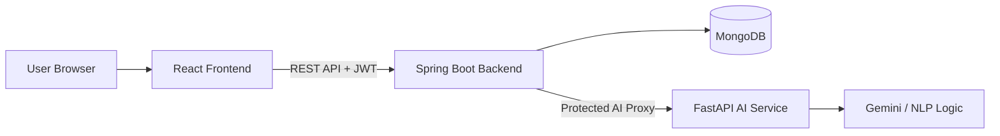
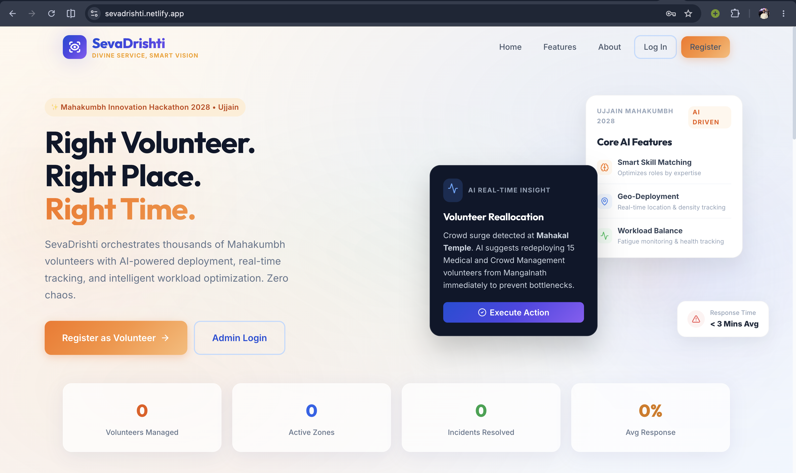
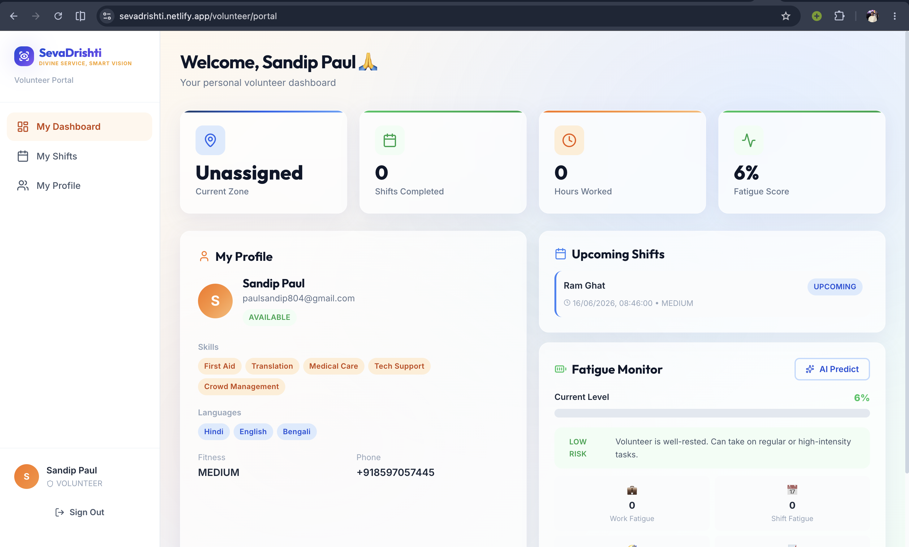
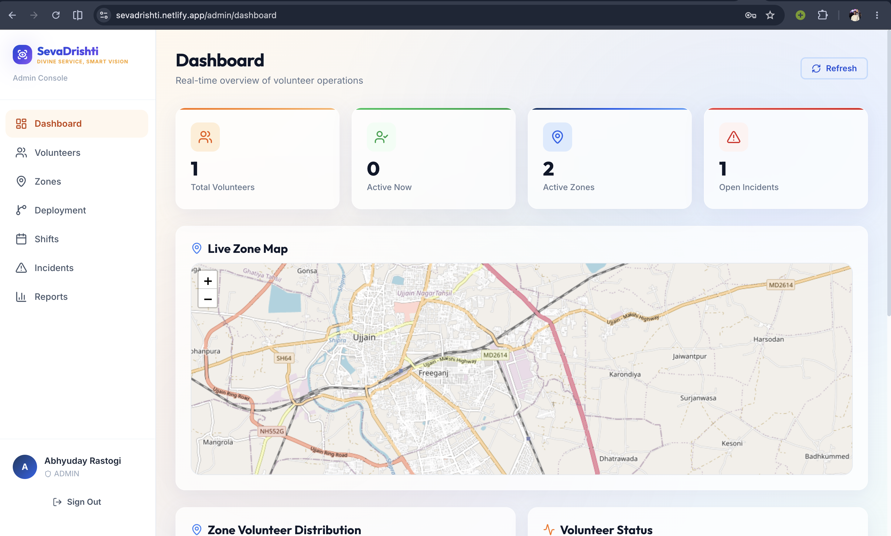
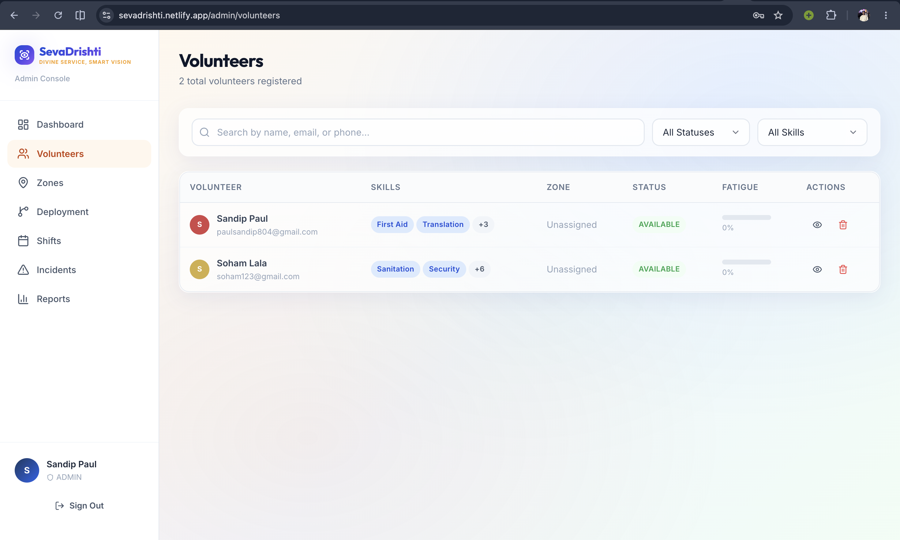
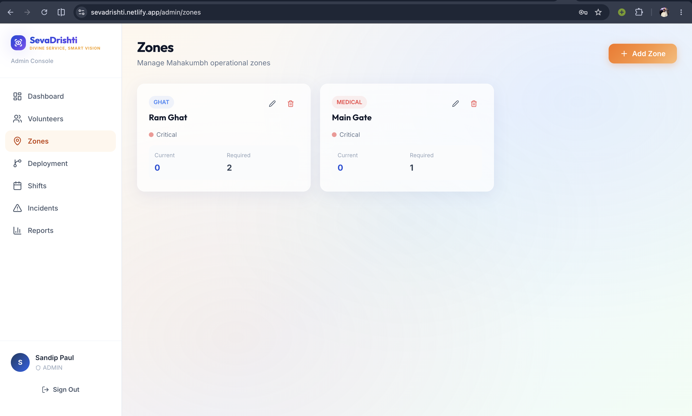
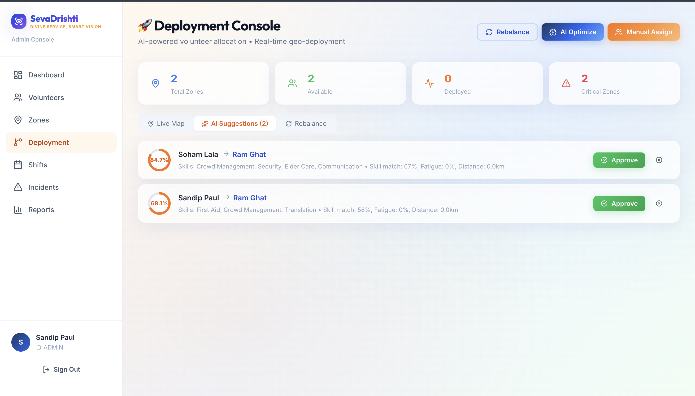
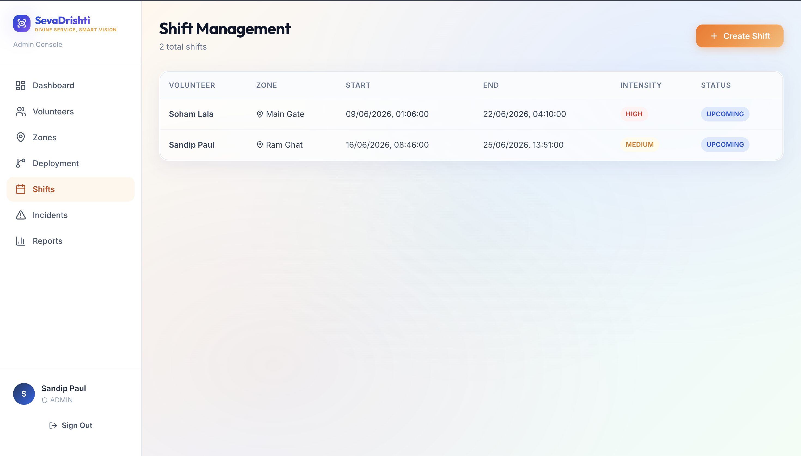

# SevaDrishti

**AI-Powered Smart Volunteer Deployment & Workforce Optimization for Mahakumbh**

> Right volunteer. Right place. Right time. Zero chaos.

SevaDrishti is an AI-driven volunteer management and deployment platform built for mega-events like Mahakumbh, where thousands of volunteers must be coordinated across ghats, camps, transit areas, medical zones, and emergency response points.

## Solution Overview

SevaDrishti replaces manual volunteer allocation with a role-aware, zone-aware, and fatigue-aware deployment system. Volunteers register with skills, languages, fitness level, availability, and preferences; administrators then use dashboards, AI recommendations, zone analytics, shift planning, and incident-response tools to deploy the right people where they are needed most.

## Key Features

- Volunteer and organizer authentication with JWT-based sessions.
- Volunteer registration with skills, languages, availability, fitness level, and preferred zones.
- AI-assisted skill tagging from volunteer experience text.
- Admin dashboard for monitoring volunteers, zones, shifts, allocations, incidents, and activity.
- Zone management with required volunteers, crowd density, status, and geolocation fields.
- Volunteer allocation and deployment workflows.
- Shift scheduling, task intensity tracking, and swap-request support.
- Incident creation, status tracking, and emergency mobilization support.
- Backend AI proxy for protected access to AI/ML services.
- Responsive frontend built for volunteer and admin workflows.

## System Architecture



### Architecture Summary

- **Frontend:** Handles volunteer registration, login, dashboards, admin operations, and user interaction.
- **Backend:** Provides REST APIs, authentication, authorization, persistence, and AI-service proxy routes.
- **Database:** Stores users, volunteers, zones, shifts, allocations, and incidents.
- **AI Service:** Performs skill matching, skill extraction, fatigue prediction, allocation optimization, rebalancing, and responder recommendations.

## AI/ML Features

The AI service is implemented as a FastAPI microservice and exposes dedicated endpoints for workforce intelligence.

### 1. AI Smart Matching

Matches volunteer skills, languages, and fitness levels against zone requirements such as ghats, camps, medical zones, transit hubs, parking areas, and entry gates.

### 2. NLP Skill Suggestions

Parses volunteer experience text and suggests relevant skill tags such as first aid, crowd management, logistics, communication, translation, event coordination, and medical care.

### 3. Allocation Optimization

Scores volunteers against zones using skills, zone demand, availability-related data, crowd density, fatigue, and operational priority.

### 4. Zone Rebalancing

Detects overstaffed and understaffed zones and recommends volunteer movements to improve coverage.

### 5. Fatigue Prediction

Predicts burnout risk using hours worked, completed shifts, task intensity, rest hours, and consecutive working days.

### 6. Incident Responder Recommendation

Ranks suitable volunteers for emergency incidents based on required skills, severity, fatigue, location, and availability.

### 7. General AI Analysis

Supports prompt-based operational analysis using contextual event data.

## Technology Stack

| Layer | Technologies |
| --- | --- |
| Frontend | React, Vite, React Router, Axios, Framer Motion, Recharts, Leaflet, Three.js, Lucide Icons |
| Backend | Java 17, Spring Boot, Spring Security, Spring Data MongoDB, JWT |
| Database | MongoDB |
| AI/ML | Python, FastAPI, Pydantic, HTTPX, Gemini API integration, rule-based scoring, NLP-style keyword extraction |
| Deployment | Static frontend hosting, cloud backend hosting, containerized AI microservice hosting |

## Workflow / User Journey

### Volunteer Journey

1. Volunteer visits the platform and registers.
2. Volunteer enters personal details, skills, languages, fitness level, availability, and preferred zones.
3. Optional AI skill suggestion helps auto-tag skills from experience text.
4. Volunteer logs in and accesses the volunteer portal.
5. Volunteer can view assignments, shifts, fatigue-related status, and operational updates.

### Admin / Organizer Journey

1. Admin logs in to the organizer dashboard.
2. Admin creates and manages zones with volunteer demand and crowd-density information.
3. Admin reviews volunteer profiles and availability.
4. Admin uses AI recommendations to assign volunteers to suitable zones.
5. Admin creates shifts and monitors workload distribution.
6. Admin tracks incidents and mobilizes appropriate volunteers during emergencies.

## Screenshots

Add screenshots inside `docs/screenshots/` and replace the placeholder files below with actual images.

### Landing Page

The landing page introduces SevaDrishti, its purpose, and the main volunteer/admin entry points.



### Volunteer Dashboard

The volunteer dashboard shows personal deployment information, assignments, shifts, and volunteer-specific activity.



### Admin Dashboard

The admin dashboard provides a high-level operational view of volunteers, zones, incidents, shifts, and activity.



### Admin Volunteers Selection

The volunteer selection screen helps admins review registered volunteers and choose suitable people for deployment.



### Admin Zones Create

The zones screen allows admins to create and manage operational zones with staffing requirements and crowd indicators.



### Admin Deployments Page

The deployments page manages volunteer-to-zone allocations and AI-assisted assignment decisions.



### Admin Shifts Page

The shifts page helps admins schedule volunteer work periods, track task intensity, and manage shift operations.



## Installation & Setup Instructions

### Prerequisites

- Node.js and npm
- Java 17
- Maven
- Python 3.10+
- MongoDB database

### 1. Clone the Repository

```bash
git clone <repository-url>
cd SevaDrishti
```

### 2. Backend Setup

```bash
cd backend
mvn clean install
mvn spring-boot:run
```

The backend runs on the configured server port and exposes APIs under `/api`.

### 3. Frontend Setup

```bash
cd frontend
npm install
npm run dev
```

The frontend starts with Vite and uses `VITE_API_URL` to connect to the backend.

### 4. AI Service Setup

```bash
cd ai-service
python -m venv .venv
source .venv/bin/activate
pip install -r requirements.txt
uvicorn main:app --host 0.0.0.0 --port 8000
```

## Environment Variables

Create local `.env` files as needed. Do not commit secrets or real production URLs.

### Frontend

```env
VITE_API_URL=<backend-api-base-url>
```

### Backend

```env
SPRING_DATA_MONGODB_URI=<mongodb-connection-uri>
SPRING_DATA_MONGODB_DATABASE=<database-name>
JWT_SECRET=<strong-jwt-secret>
JWT_EXPIRATION=<token-expiration-ms>
CORS_ALLOWED_ORIGINS=<comma-separated-allowed-frontend-origins>
AI_SERVICE_URL=<ai-service-base-url>
MONGODB_CONNECT_TIMEOUT_MS=<connect-timeout-ms>
MONGODB_READ_TIMEOUT_MS=<read-timeout-ms>
MONGODB_SERVER_SELECTION_TIMEOUT_MS=<server-selection-timeout-ms>
```

### AI Service

```env
GEMINI_API_KEY=<gemini-api-key>
```

## API Documentation Overview

All backend routes are prefixed with `/api`.

### Authentication

| Method | Endpoint | Description |
| --- | --- | --- |
| POST | `/api/auth/register` | Register a volunteer, admin, or coordinator |
| POST | `/api/auth/login` | Login and receive JWT token |
| GET | `/api/auth/me` | Get current authenticated user |
| GET | `/api/auth/health` | Backend health check |

### Volunteers

| Method | Endpoint | Description |
| --- | --- | --- |
| GET | `/api/volunteers` | List volunteers |
| GET | `/api/volunteers/{id}` | Get volunteer by ID |
| GET | `/api/volunteers/me` | Get current volunteer profile |
| GET | `/api/volunteers/available` | List available volunteers |
| GET | `/api/volunteers/by-zone/{zoneId}` | List volunteers by zone |
| POST | `/api/volunteers` | Create volunteer |
| PUT | `/api/volunteers/{id}` | Update volunteer |
| DELETE | `/api/volunteers/{id}` | Delete volunteer |

### Zones

| Method | Endpoint | Description |
| --- | --- | --- |
| GET | `/api/zones` | List zones |
| GET | `/api/zones/{id}` | Get zone by ID |
| POST | `/api/zones` | Create zone |
| PUT | `/api/zones/{id}` | Update zone |
| PUT | `/api/zones/{id}/crowd-density` | Update crowd density |
| DELETE | `/api/zones/{id}` | Delete zone |

### Allocations

| Method | Endpoint | Description |
| --- | --- | --- |
| GET | `/api/allocations` | List allocations |
| GET | `/api/allocations/zone/{zoneId}` | List allocations by zone |
| POST | `/api/allocations/assign` | Assign volunteer to zone |

### Shifts

| Method | Endpoint | Description |
| --- | --- | --- |
| GET | `/api/shifts` | List shifts |
| GET | `/api/shifts/volunteer/{volunteerId}` | List shifts for volunteer |
| POST | `/api/shifts` | Create shift |
| PUT | `/api/shifts/{id}` | Update shift |
| POST | `/api/shifts/swap-request` | Request shift swap |

### Incidents

| Method | Endpoint | Description |
| --- | --- | --- |
| GET | `/api/incidents` | List incidents |
| GET | `/api/incidents/{id}` | Get incident by ID |
| POST | `/api/incidents` | Create incident |
| PUT | `/api/incidents/{id}/status` | Update incident status |
| POST | `/api/incidents/{id}/mobilize` | Mobilize volunteers for incident |

### Dashboard

| Method | Endpoint | Description |
| --- | --- | --- |
| GET | `/api/dashboard/stats` | Get dashboard statistics |
| GET | `/api/dashboard/activity-feed` | Get recent activity feed |

### AI Proxy

Backend AI routes are protected and proxied through `/api/ai`.

| Method | Endpoint | Description |
| --- | --- | --- |
| GET | `/api/ai/health` | AI service health check |
| POST | `/api/ai/skill-match` | Match volunteer skills to zones |
| POST | `/api/ai/suggest-tags` | Suggest skill tags from text |
| POST | `/api/ai/optimize-allocation` | Optimize volunteer allocation |
| POST | `/api/ai/predict-fatigue` | Predict fatigue risk |
| POST | `/api/ai/bulk-fatigue` | Predict fatigue for multiple volunteers |
| POST | `/api/ai/incident-responders` | Recommend responders for incidents |
| POST | `/api/ai/rebalance-zones` | Recommend zone rebalancing |
| POST | `/api/ai/analyze` | Run general AI analysis |

## Database Schema Overview

### `users`

Stores authentication and user identity data.

- `id`
- `name`
- `email`
- `password`
- `role`
- `phone`
- `createdAt`

### `volunteers`

Stores volunteer profile, capabilities, availability, and workload data.

- `id`
- `userId`
- `name`
- `email`
- `phone`
- `age`
- `emergencyContact`
- `address`
- `skills`
- `languages`
- `fitnessLevel`
- `experience`
- `availableFrom`
- `availableTo`
- `shiftPreference`
- `preferredZones`
- `currentZone`
- `status`
- `fatigueScore`
- `shiftsCompleted`
- `totalHoursWorked`
- `createdAt`

### `zones`

Stores operational zone data.

- `id`
- `name`
- `type`
- `latitude`
- `longitude`
- `requiredVolunteers`
- `currentVolunteers`
- `crowdDensity`
- `description`
- `status`

### `allocations`

Stores volunteer deployment records.

- `id`
- `volunteerId`
- `volunteerName`
- `zoneId`
- `zoneName`
- `assignedBy`
- `aiRecommended`
- `score`
- `status`
- `createdAt`

### `shifts`

Stores volunteer shift assignments.

- `id`
- `volunteerId`
- `volunteerName`
- `zoneId`
- `zoneName`
- `startTime`
- `endTime`
- `taskIntensity`
- `status`
- `createdAt`

### `incidents`

Stores emergency and operational incidents.

- `id`
- `type`
- `severity`
- `zoneId`
- `zoneName`
- `description`
- `status`
- `assignedVolunteers`
- `createdAt`
- `resolvedAt`

## Scalability & Performance Considerations

- Stateless JWT authentication supports horizontal backend scaling.
- AI service is separated from the backend so ML workloads can scale independently.
- MongoDB document collections support flexible event and volunteer data.
- Backend proxy pattern keeps AI-service access controlled and centralized.
- Request timeouts reduce long waits during network or database slowdowns.
- Email indexing improves login and registration lookup performance.
- Frontend build can be served through CDN-backed static hosting.

## Security Features

- JWT-based authentication for protected routes.
- Password hashing with BCrypt.
- Role-aware frontend navigation and backend authorization boundaries.
- CORS allowlist for approved frontend origins.
- Environment-based secret configuration.
- Protected backend-to-AI proxy instead of exposing AI routes directly from the frontend.
- Input validation and duplicate-email protection during registration.
- No secrets or production URLs should be committed to source control.

## Innovation & Uniqueness

- Purpose-built for high-density event operations such as Mahakumbh.
- Combines volunteer skills, languages, fitness, fatigue, and zone demand into deployment decisions.
- Supports both planned deployment and emergency response.
- Uses AI not as a separate chatbot, but as operational intelligence inside real admin workflows.
- Bridges volunteer registration, workforce planning, zone monitoring, shift management, and incident response in one platform.

## Future Enhancements

- Real-time volunteer location tracking with geofencing.
- Live crowd-density ingestion from cameras, IoT sensors, or external feeds.
- Push notifications for urgent deployment changes.
- Mobile-first volunteer app experience.
- Advanced route optimization for nearest responder dispatch.
- Multi-event and multi-organization support.
- Audit logs for all deployment and incident actions.
- Offline mode for low-connectivity event areas.
- Predictive staffing forecasts before peak crowd periods.

## Live Deployment Link Placeholder

- Frontend: `<frontend-live-url>`
- Backend API: `<backend-api-url>`
- AI Service: `<ai-service-url>`
